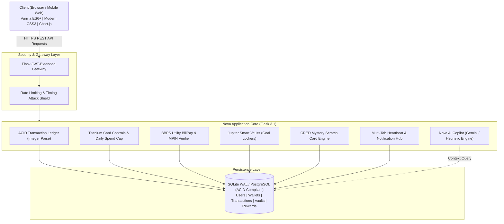

# 💎 NovaWallet — Tier-1 Neo-Banking & Digital Wallet Platform

[](https://python.org)
[](https://flask.palletsprojects.com/)
[-red?logo=sqlalchemy&logoColor=white)](https://www.sqlalchemy.org/)
[](https://flask-jwt-extended.readthedocs.io/)
[](https://developer.mozilla.org/)
[](LICENSE)
[](#-automated-testing-suite)
[](render.yaml)

> **NovaWallet** is a production-grade Tier-1 Neo-Banking & Digital Wallet application engineered with the workflows, security safeguards, and fluid user experience inspired by **CRED, Google Pay, Jupiter, and RazorpayX**.

Designed and built from the ground up by **[Priyanshu Chauhan](https://github.com/PriyanshuChauhan-007)**.

---

## 📑 Table of Contents

- [✨ Overview](#-overview)
- [🌟 Key Architectural Pillars & Features](#-key-architectural-pillars--features)
  - [1. 💳 Titanium Virtual Debit Card & Neo-Controls (Jupiter & RazorpayX)](#1--titanium-virtual-debit-card--neo-controls-jupiter--razorpayx)
  - [2. 🎁 CRED-Style Mystery Scratch Cards & Rewards Engine](#2--cred-style-mystery-scratch-cards--rewards-engine)
  - [3. ⚡ BBPS Utility BillPay Engine (Bharat Bill Payment System)](#3--bbps-utility-billpay-engine-bharat-bill-payment-system)
  - [4. 🔒 Jupiter Smart Vaults (Goal Lockers)](#4--jupiter-smart-vaults-goal-lockers)
  - [5. 🤖 Nova AI Financial Advisor & Copilot](#5--nova-ai-financial-advisor--copilot)
  - [6. 🔄 Real-Time Multi-Tab Sync & Notification Hub](#6--real-time-multi-tab-sync--notification-hub)
  - [7. 🌓 Full-Spectrum Adaptive Light & Dark Theme](#7--full-spectrum-adaptive-light--dark-theme)
  - [8. 🛡️ Enterprise Security & ACID Financial Ledger](#8--enterprise-security--acid-financial-ledger)
- [🏗️ System Architecture & Data Flow](#️-system-architecture--data-flow)
- [🚀 Quick Demo Credentials](#-quick-demo-credentials)
- [🛠️ Tech Stack](#️-tech-stack)
- [📋 Complete API Reference](#-complete-api-reference)
- [💻 Getting Started & Local Installation](#-getting-started--local-installation)
- [🧪 Automated Testing Suite](#-automated-testing-suite)
- [☁️ Production Deployment (Render)](#️-production-deployment-render)
- [📂 Project Directory Structure](#-project-directory-structure)
- [📄 License & Author](#-license--author)

---

## ✨ Overview

NovaWallet is a full-stack payments web application designed to demonstrate how real consumer fintech platforms operate behind the scenes. Built without bloated frontend frameworks, it uses clean **Vanilla ES6+** and **Vanilla CSS3** to achieve 60fps micro-animations, glassmorphic cards, instant tactile feedback, and fast load times.

The backend is built with **Flask 3.1**, **SQLAlchemy 2.0**, and **Flask-JWT-Extended**, maintaining strict ledger consistency through **integer-paise accounting**, deadlock-free row locking, and atomic rollbacks on transaction failure.

---

## 🌟 Key Architectural Pillars & Features

### 1. 💳 Titanium Virtual Debit Card & Neo-Controls (Jupiter & RazorpayX)
- **Instant Kill-Switch Freeze / Unfreeze**: One-tap toggle that updates card security status with a real-time frosted-glass UI overlay. Outgoing transfers and bill payments are blocked on both client and server when the card is frozen.
- **Secure Credential Reveal**: Decrypts and displays the unmasked 16-digit card number (PAN) and 3-digit CVV on demand with a 1-click clipboard copy utility.
- **Dynamic Daily Spend Cap**: Real-time slider (`₹5,000` to `₹2,00,000` in ₹5,000 increments) with immediate visual feedback, debounced API persistence, and server-side transfer enforcement.
- **Primary Bank Switcher**: 1-click toggling between linked primary funding sources (HDFC Core Banking vs. ICICI Bank).

### 2. 🎁 CRED-Style Mystery Scratch Cards & Rewards Engine
- **HTML5 Canvas Physical Scratching**: Interactive coin scratch simulation with particle dust physics and real-time scratch-percentage detection.
- **Confetti Celebration**: Canvas particle burst on unlocking cashback rewards.
- **Direct-to-Wallet Cashback**: Real cash deposits credited directly to the user's liquid wallet ledger.
- **Realistic Merchant Partners**: Authentic scratch card rewards themed around popular consumer merchants (Swiggy, Zomato, Amazon Pay, Blinkit, Uber, Starbucks).

### 3. ⚡ BBPS Utility BillPay Engine (Bharat Bill Payment System)
- **Multi-Category Hub**: Instant payment settlement for **Electricity, Mobile Recharge, FASTag, Broadband, and Credit Cards**.
- **1-Click Bill Fetch**: Simulates operator queries using real-world utility billers and realistic consumer dues.
- **4-Digit UPI MPIN Security**: Cryptographically verified MPIN challenge (`1234`) before authorizing atomic debits.
- **Automated Reward Generation**: Every eligible bill payment auto-generates a surprise scratch card reward.

### 4. 🔒 Jupiter Smart Vaults (Goal Lockers)
- **Ring-Fenced Savings Lockers**: Isolate funds into specific goals (e.g. *Emergency Reserve*, *MacBook Pro M4 Fund*).
- **Goal Progress Trackers**: Visual progress bars showing percentage completion toward each target.
- **Atomic Goal Allocation**: Safe fund transfers between liquid wallet balance and locked vaults with strict non-negative check constraints.

### 5. 🤖 Nova AI Financial Advisor & Copilot
- **Automated Liquidity & Reserve Health**: Algorithmic scoring of reserve ratios, emergency cover health, and category spending distributions.
- **Google Gemini AI Integration**: Natural language copilot that analyzes user ledger context to answer conversational financial questions.
- **Reliable Fallback Rules**: Gracefully falls back to deterministic algorithmic financial insights if no Gemini API key is configured.

### 6. 🔄 Real-Time Multi-Tab Sync & Notification Hub
- **Multi-Tab State Synchronization**: Automated polling heartbeat (`/api/sync`) ensuring balance changes, notifications, and card states update across all open tabs simultaneously without manual page refreshes.
- **Real-Time Notification Feed**: Interactive bell modal with unread badge counter, timestamped audit events (CREDIT, DEBIT, REWARD, SECURITY), and 1-click "Mark All Read".

### 7. 🌓 Full-Spectrum Adaptive Light & Dark Theme
- **Theme Engine**: Complete HSL-based design token architecture (`var(--surface)`, `var(--primary)`, `var(--text)`, etc.).
- **Consistent Contrast**: Guaranteed readability in both Dark and Light modes across all badges, modals, charts, and input fields.
- **Persistent Preference**: Remembers the selected theme in `localStorage`.

### 8. 🛡️ Enterprise Security & ACID Financial Ledger
- **Integer-Paise Accounting**: All balances and transactions are stored internally as integer paise (`₹1.00 = 100 paise`), eliminating floating-point rounding errors.
- **Deadlock-Free Row Locking**: Two-phase atomic transfers sort account IDs deterministically (`sorted([sender_id, receiver_id])`) before row updates.
- **Timing Attack Resistance**: Uniform dummy password hashing runs even on invalid username lookups to prevent user enumeration via timing differentials.
- **Stateless JWT Security**: JWT bearer tokens signed with cryptographic keys with strict expiry handling.

---

## 🏗️ System Architecture & Data Flow



---

## 🚀 Quick Demo Credentials

For instant demonstration and evaluation without registration, use the **Founder Demo** account:

| Attribute | Demo Account Value |
| :--- | :--- |
| **Username** | `priyanshu` |
| **Password** | `Nova@123` |
| **UPI MPIN** | `1234` |
| **Initial Wallet Balance** | **₹45,000.00** |
| **Linked Core Bank (HDFC)** | **₹1,50,000.00** |
| **Total Net Worth** | **₹2,20,000.00** |
| **Pre-seeded Ledger** | Amazon Pay India, Zomato Limited, Reliance Jio, Swiggy, IRCTC |
| **Smart Vaults** | Emergency Reserve (₹10k), MacBook Pro M4 Fund (₹15k) |
| **Scratch Cards** | 2 Ready-to-scratch mystery cashback rewards |

*(You can also register a brand-new custom account anytime via the Signup tab).*

---

## 🛠️ Tech Stack

### Backend
- **Python 3.11+**: Core runtime
- **Flask 3.1.3**: Microframework with modular blueprint routing
- **SQLAlchemy 2.0 / Flask-SQLAlchemy 3.1**: ORM with ACID transaction boundaries
- **Flask-JWT-Extended 4.7**: Stateless authentication & token life-cycle management
- **Werkzeug 3.1**: Security utilities (PBKDF2-SHA256 password hashing)
- **Gunicorn 21.2+**: High-concurrency production WSGI HTTP server

### Frontend
- **HTML5 Semantic Markup**: Clean, accessible markup with ARIA tags
- **Vanilla CSS3**: Design system with HSL tokens, glassmorphism, flexbox/grid, zero bloated UI libraries
- **Vanilla JavaScript (ES6+)**: Custom DOM controllers, Canvas scratch mechanics, debounced API calls
- **Chart.js**: Financial expenditure distribution charts
- **Google Fonts (Inter)**: Clean modern typography

### Database & Deployment
- **SQLite 3 (WAL mode)**: Zero-config local development with Write-Ahead Logging
- **PostgreSQL Ready**: Compatible with enterprise SQL backends via `DATABASE_URL`
- **Render Cloud**: Pre-configured via `render.yaml` and `Procfile`

---

## 📋 Complete API Reference

### 🔐 Authentication
| Method | Endpoint | Auth | Description |
| :--- | :--- | :--- | :--- |
| `POST` | `/api/signup` | Public | Register a new user account with wallet & bank provisioning |
| `POST` | `/api/login` | Public | Authenticate username/password and receive JWT access token |
| `GET` | `/api/me` | JWT | Fetch complete user snapshot (balances, vaults, cards, stats, history) |

### 💸 Core Banking & Ledger
| Method | Endpoint | Auth | Description |
| :--- | :--- | :--- | :--- |
| `POST` | `/api/transfer` | JWT | Peer-to-peer atomic transfer to another username |
| `POST` | `/api/load` | JWT | Instant inward load from linked Core Bank into liquid wallet |
| `GET` | `/api/directory` | JWT | List eligible recipient usernames for payment autocompletion |
| `POST` | `/api/request` | JWT | Create a formal payment request |
| `POST` | `/api/request/respond` | JWT | Accept and pay or decline an incoming payment request |

### 💳 Titanium Card Controls
| Method | Endpoint | Auth | Description |
| :--- | :--- | :--- | :--- |
| `POST` | `/api/card/freeze` | JWT | Instant toggle to Freeze / Unfreeze card kill-switch |
| `POST` | `/api/card/reveal` | JWT | Authenticated reveal of unmasked 16-digit PAN & 3-digit CVV |
| `POST` | `/api/card/limit` | JWT | Update daily spend cap (`₹5,000` to `₹2,00,000`) |
| `POST` | `/api/card/switch_bank` | JWT | Switch linked funding bank (HDFC Bank vs ICICI Bank) |

### 🎁 CRED Scratch Cards & Rewards
| Method | Endpoint | Auth | Description |
| :--- | :--- | :--- | :--- |
| `GET` | `/api/rewards` | JWT | Fetch all user reward cards and unclaimed rewards |
| `POST` | `/api/rewards/claim` | JWT | Scratch & claim mystery card; deposits cashback to wallet |

### ⚡ BBPS Utility BillPay Engine
| Method | Endpoint | Auth | Description |
| :--- | :--- | :--- | :--- |
| `POST` | `/api/bills/fetch` | JWT | Query operator by category & consumer ID to fetch due bill |
| `POST` | `/api/bills/pay` | JWT | Pay bill with 4-digit UPI MPIN validation and cashback trigger |

### 🔒 Jupiter Smart Vaults
| Method | Endpoint | Auth | Description |
| :--- | :--- | :--- | :--- |
| `GET` | `/api/vaults` | JWT | List user vaults with target amounts & progress |
| `POST` | `/api/vaults/deposit` | JWT | Move liquid wallet funds into a locked vault |
| `POST` | `/api/vaults/withdraw` | JWT | Unlock vault funds back into liquid wallet balance |

### 🤖 AI Financial Advisor & Real-Time Sync
| Method | Endpoint | Auth | Description |
| :--- | :--- | :--- | :--- |
| `GET` | `/api/ai/insights` | JWT | Retrieve automated liquidity ratios & spending health analysis |
| `POST` | `/api/ai/ask` | JWT | Natural language financial questions via Gemini / AI heuristics |
| `GET` | `/api/notifications` | JWT | Fetch notification audit feed with unread count |
| `POST` | `/api/notifications/read` | JWT | Mark all notifications as read |
| `GET` | `/api/sync` | JWT | Lightweight heartbeat syncing balances across browser tabs |

---

## 💻 Getting Started & Local Installation

### Prerequisites
- Python 3.11 or higher
- Git

### 1. Clone the Repository
```bash
git clone https://github.com/PriyanshuChauhan-007/NovaWallet.git
cd NovaWallet
```

### 2. Create and Activate a Virtual Environment
```bash
# Windows
python -m venv .venv
.venv\Scripts\activate

# macOS / Linux
python3 -m venv .venv
source .venv/bin/activate
```

### 3. Install Dependencies
```bash
pip install -r requirements.txt
```

### 4. Configure Environment Variables (Optional)
```bash
# Copy template
cp .env.example .env

# On Windows PowerShell:
# Copy-Item .env.example .env
```
*(If unset, NovaWallet runs with secure local defaults and initializes SQLite automatically).*

### 5. Launch the Application
```bash
python app.py
```
Open your browser and navigate to: **`http://localhost:5000`**

Click **"Priyanshu Chauhan (Founder Demo)"** for 1-click login!

---

## 🧪 Automated Testing Suite

NovaWallet includes two comprehensive automated test suites covering authentication, ACID transactions, card security controls, rewards, BBPS bill payments, and database hygiene.

### Run Tier-1 Fintech Test Suite:
```bash
python test_fintech_endpoints.py
```
**Tests Covered:**
- ✅ Founder Demo authentication & JWT acquisition
- ✅ Wallet & core bank balances integrity
- ✅ CRED scratch card claiming & instant cashback balance credit
- ✅ BBPS bill fetch & UPI MPIN atomic payment
- ✅ Card freeze kill-switch & unfreeze validation
- ✅ Card PAN (4532 ...) & CVV (481) reveal authentication
- ✅ Daily spend cap boundary enforcement (rejects over-limit transactions)
- ✅ Notification feed & mark-as-read
- ✅ Real-time multi-tab sync endpoint (`/api/sync`)
- ✅ Zero purged names verification across all database tables

### Run Auth Flow & AI Advisory Test Suite:
```bash
python test_auth_flow.py
```
**Tests Covered:**
- ✅ User signup, password hashing, and token issuance
- ✅ Authenticated `/api/me` profile resolution
- ✅ Logout, token discard, and re-login
- ✅ Recipient directory lookup
- ✅ Vault deposit and withdrawal balance isolation
- ✅ AI Financial Insights & natural language question endpoint

---

## ☁️ Production Deployment (Render)

NovaWallet is production-ready for deployment on **Render**:

1. Push your repository to GitHub.
2. In the Render Dashboard, create a **New Web Service** and link your repository.
3. Configure settings:
   - **Environment**: `Python`
   - **Build Command**: `pip install -r requirements.txt`
   - **Start Command**: `gunicorn app:app`
4. Add Environment Variables:
   - `PYTHON_VERSION`: `3.11.9`
   - `FLASK_SECRET_KEY`: *(Generate a secure random string)*
   - `JWT_SECRET_KEY`: *(Generate a secure random string)*
   - `FLASK_DEBUG`: `0`
5. Click **Deploy Web Service**.

Alternatively, Render will automatically detect the included [`render.yaml`](render.yaml) blueprint!

---

## 📂 Project Directory Structure

```plaintext
NovaWallet/
├── .env.example             # Environment configuration template
├── .gitignore               # Comprehensive Git exclusion rules
├── LICENSE                  # Open-source MIT License
├── Procfile                 # Production WSGI process definition (Gunicorn)
├── README.md                # Comprehensive project documentation
├── app.py                   # Core Flask application, ACID ledger & REST APIs
├── render.yaml              # Render Cloud deployment blueprint
├── requirements.txt         # Production Python dependencies
├── static/
│   ├── css/
│   │   └── style.css        # Adaptive Light/Dark design system (HSL tokens)
│   └── js/
│       └── main.js          # Client controller, Canvas scratch, Card controls
├── templates/
│   └── index.html           # Semantic HTML5 single-page application view
├── test_auth_flow.py        # Automated test suite for Auth, Vaults & AI
├── test_fintech_endpoints.py# Automated test suite for Card, BBPS, Rewards & Sync
└── wallet_data.json         # Legacy fallback migration dictionary
```

---

## 📄 License & Author

Distributed under the **MIT License**. See [`LICENSE`](LICENSE) for more information.

Developed with ❤️ by **[Priyanshu Chauhan](https://github.com/PriyanshuChauhan-007)**.
