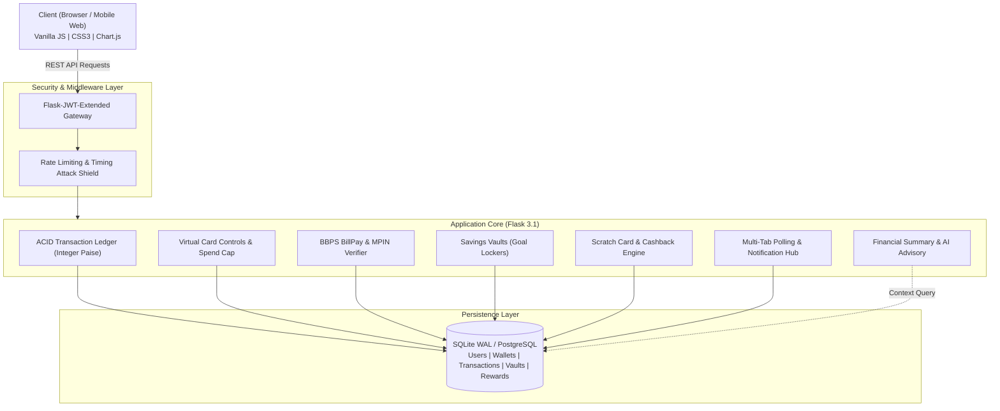

# NovaWallet

[](https://python.org)
[](https://flask.palletsprojects.com/)
[](https://www.sqlalchemy.org/)
[](https://flask-jwt-extended.readthedocs.io/)
[](https://developer.mozilla.org/)
[](LICENSE)
[](render.yaml)

A full-stack digital wallet and payments web application built with Python (Flask) and vanilla JavaScript.

NovaWallet simulates modern consumer payment workflows, including peer-to-peer transfers, virtual debit card controls, utility bill payments, interactive scratch-to-win cashback rewards, and goal-based savings vaults. It was built to explore how real-world fintech applications handle ledger consistency, state management, and user controls.

**Live Demo:** [https://novawallet-x6o5.onrender.com/](https://novawallet-x6o5.onrender.com/)

Developed by **[Priyanshu Chauhan](https://github.com/PriyanshuChauhan-007)**.

---

## Table of Contents

- [Overview](#overview)
- [Features](#features)
  - [Virtual Debit Card Controls](#virtual-debit-card-controls)
  - [Scratch Cards & Rewards](#scratch-cards--rewards)
  - [Utility Bill Payments (BBPS Simulation)](#utility-bill-payments-bbps-simulation)
  - [Smart Savings Vaults](#smart-savings-vaults)
  - [Financial Summary & AI Insights](#financial-summary--ai-insights)
  - [Real-Time Sync & Notifications](#real-time-sync--notifications)
  - [Light & Dark Themes](#light--dark-themes)
  - [Transaction Ledger & Security](#transaction-ledger--security)
- [System Architecture](#system-architecture)
- [Demo Account](#demo-account)
- [Tech Stack](#tech-stack)
- [API Reference](#api-reference)
- [Installation & Local Setup](#installation--local-setup)
- [Running Tests](#running-tests)
- [Deployment](#deployment)
- [Project Structure](#project-structure)
- [License](#license)

---

## Overview

NovaWallet combines practical payment features with a clean, responsive interface. The application avoids heavy frontend frameworks and is built with vanilla JavaScript (ES6+) and custom CSS, providing fast page loads and smooth micro-interactions.

The backend uses Flask 3.1, SQLAlchemy 2.0, and Flask-JWT-Extended. Financial operations are tracked in integer paise to avoid rounding discrepancies, with atomic transaction rollbacks and deadlock-safe database updates.

---

## Features

### Virtual Debit Card Controls
- **Card Freeze / Unfreeze**: One-click kill switch that updates card security status. When frozen, transfers and bill payments are blocked on both client and server.
- **Card Details Reveal**: View the unmasked 16-digit card number (PAN) and 3-digit CVV on demand with a quick-copy utility.
- **Daily Spend Limit**: Real-time slider from ₹5,000 to ₹2,00,000. Changes update the UI immediately, persist to the backend with debouncing, and are enforced on all outgoing transactions.
- **Linked Bank Switcher**: Switch the primary funding account between HDFC Bank and ICICI Bank.

### Scratch Cards & Rewards
- **Canvas Scratch Cards**: Interactive scratch-to-reveal cards built with HTML5 canvas and particle effects.
- **Direct Cashback**: Revealing a card automatically deposits the cashback amount directly into the user's wallet balance.
- **Merchant Rewards**: Rewards are themed around everyday consumer merchants such as Swiggy, Zomato, Amazon Pay, and Blinkit.

### Utility Bill Payments (BBPS Simulation)
- **Supported Categories**: Pay bills across Electricity, Mobile Recharge, FASTag, Broadband, and Credit Cards.
- **Bill Fetching**: Simulates operator lookups with realistic biller names and consumer numbers.
- **UPI MPIN Validation**: Requires a 4-digit MPIN (`1234`) before authorizing payments.
- **Reward Trigger**: Every successful bill payment automatically unlocks a surprise scratch card.

### Smart Savings Vaults
- **Goal Lockers**: Separate funds from the main wallet balance for specific targets (e.g., Emergency Reserve, MacBook Fund).
- **Progress Tracking**: Progress bars display percentage completion toward each target.
- **Safe Transfers**: Move money in and out of vaults atomically without balance leaks or negative amounts.

### Financial Summary & AI Insights
- **Balance Breakdown**: Quick overview of liquid wallet funds, linked bank funds, vault savings, and total net worth.
- **Category Charts**: Expense distribution visualization powered by Chart.js.
- **Health Indicators**: Automated metrics showing reserve ratios and top spending categories.
- **AI Financial Assistant**: Natural language question answering using Google Gemini (with rule-based fallback).

### Real-Time Sync & Notifications
- **Multi-Tab Sync**: Background polling keeps balances, card status, and notifications consistent across multiple open browser tabs.
- **Notification Feed**: Dropdown bell menu showing recent credit, debit, reward, and security alerts with a "Mark All Read" action.

### Light & Dark Themes
- **Theme Switcher**: Complete CSS custom property system supporting both light and dark modes.
- **Accessible Contrast**: All text, badges, cards, and input controls maintain readable contrast ratios in both themes.
- **Saved State**: Remembers the user's theme selection in `localStorage`.

### Transaction Ledger & Security
- **Integer Paise Accounting**: All balances and transactions are stored internally as integer paise (₹1.00 = 100 paise) to prevent floating-point calculation errors.
- **Deadlock-Safe Transfers**: Transfers sort sender and receiver IDs before acquiring row locks, ensuring reliable two-phase commits.
- **Timing Attack Mitigation**: Uses dummy password verification on non-existent usernames to prevent timing-based user enumeration.
- **JWT Authentication**: Stateless token authentication with standard expiration and refresh handling.

---

## System Architecture



---

## Demo Account

For quick evaluation without manual signup, use the pre-seeded demo account:

| Field | Value |
| :--- | :--- |
| **Username** | `priyanshu` |
| **Password** | `Nova@123` |
| **UPI MPIN** | `1234` |
| **Initial Wallet Balance** | ₹45,000.00 |
| **Linked Bank Balance** | ₹1,50,000.00 |
| **Total Net Worth** | ₹2,20,000.00 |
| **Sample Ledger** | Amazon Pay India, Zomato Limited, Reliance Jio, Swiggy, IRCTC |
| **Pre-seeded Vaults** | Emergency Reserve (₹10,000), MacBook Pro M4 Fund (₹15,000) |
| **Scratch Cards** | 2 unclaimed cards ready to scratch |

You can also create a new account anytime via the registration form.

---

## Tech Stack

### Backend
- **Python 3.11+**: Application runtime
- **Flask 3.1.3**: Web framework and REST API routing
- **SQLAlchemy 2.0 / Flask-SQLAlchemy 3.1**: Database ORM and transaction management
- **Flask-JWT-Extended 4.7**: JWT token issuance and route protection
- **Werkzeug 3.1**: Password hashing (PBKDF2-SHA256)
- **Gunicorn 21.2+**: WSGI HTTP server for production

### Frontend
- **HTML5**: Semantic document structure
- **Vanilla CSS3**: Custom design tokens, glassmorphism, flexbox, and CSS grid
- **Vanilla JavaScript (ES6+)**: UI controllers, canvas scratch engine, debounced API calls
- **Chart.js**: Financial expenditure distribution chart
- **Google Fonts (Inter)**: Clean interface typography

### Database & Hosting
- **SQLite 3 (WAL mode)**: Default local database with Write-Ahead Logging
- **PostgreSQL**: Supported via `DATABASE_URL` environment variable
- **Render Cloud**: Configured via `render.yaml` and `Procfile`

---

## API Reference

### Authentication
| Method | Endpoint | Auth | Description |
| :--- | :--- | :--- | :--- |
| `POST` | `/api/signup` | Public | Register a new user account |
| `POST` | `/api/login` | Public | Log in with username and password |
| `GET` | `/api/me` | JWT | Fetch current user balances, card, vaults, and history |

### Core Banking & Transfers
| Method | Endpoint | Auth | Description |
| :--- | :--- | :--- | :--- |
| `POST` | `/api/transfer` | JWT | Transfer funds to another user |
| `POST` | `/api/load` | JWT | Add money to wallet from linked bank account |
| `GET` | `/api/directory` | JWT | List usernames for recipient autocomplete |
| `POST` | `/api/request` | JWT | Create a payment request |
| `POST` | `/api/request/respond` | JWT | Accept or decline a payment request |

### Card Controls
| Method | Endpoint | Auth | Description |
| :--- | :--- | :--- | :--- |
| `POST` | `/api/card/freeze` | JWT | Toggle card freeze status |
| `POST` | `/api/card/reveal` | JWT | Reveal unmasked 16-digit PAN and CVV |
| `POST` | `/api/card/limit` | JWT | Set daily spend limit (₹5,000 to ₹2,00,000) |
| `POST` | `/api/card/switch_bank` | JWT | Switch linked funding bank (HDFC vs ICICI) |

### Rewards & Scratch Cards
| Method | Endpoint | Auth | Description |
| :--- | :--- | :--- | :--- |
| `GET` | `/api/rewards` | JWT | List user reward cards |
| `POST` | `/api/rewards/claim` | JWT | Claim scratch card cashback |

### Utility Bill Payments
| Method | Endpoint | Auth | Description |
| :--- | :--- | :--- | :--- |
| `POST` | `/api/bills/fetch` | JWT | Fetch bill details by operator and consumer ID |
| `POST` | `/api/bills/pay` | JWT | Pay bill using 4-digit UPI MPIN |

### Savings Vaults
| Method | Endpoint | Auth | Description |
| :--- | :--- | :--- | :--- |
| `GET` | `/api/vaults` | JWT | List savings vaults and targets |
| `POST` | `/api/vaults/deposit` | JWT | Move funds from wallet into a vault |
| `POST` | `/api/vaults/withdraw` | JWT | Move funds from vault back to wallet |

### AI Advisory & Sync
| Method | Endpoint | Auth | Description |
| :--- | :--- | :--- | :--- |
| `GET` | `/api/ai/insights` | JWT | Get automated liquidity ratios and spending summary |
| `POST` | `/api/ai/ask` | JWT | Ask financial questions via Gemini or rule-based fallback |
| `GET` | `/api/notifications` | JWT | Get notification feed and unread count |
| `POST` | `/api/notifications/read` | JWT | Mark notifications as read |
| `GET` | `/api/sync` | JWT | Multi-tab polling heartbeat for balances |

---

## Installation & Local Setup

### Prerequisites
- Python 3.11 or higher
- Git

### 1. Clone the repository
```bash
git clone https://github.com/PriyanshuChauhan-007/NovaWallet.git
cd NovaWallet
```

### 2. Create and activate a virtual environment
```bash
# Windows
python -m venv .venv
.venv\Scripts\activate

# macOS / Linux
python3 -m venv .venv
source .venv/bin/activate
```

### 3. Install dependencies
```bash
pip install -r requirements.txt
```

### 4. Configure environment (optional)
```bash
# Windows PowerShell
Copy-Item .env.example .env

# macOS / Linux
cp .env.example .env
```
*(If unset, the app uses safe local defaults and initializes SQLite automatically).*

### 5. Run the application
```bash
python app.py
```
Open `http://localhost:5000` in your browser.

Use **"Priyanshu Chauhan (Founder Demo)"** for instant one-click login.

---

## Running Tests

NovaWallet includes two automated test suites covering authentication, ledger math, card controls, bill payments, and sync:

### Run the core fintech test suite:
```bash
python test_fintech_endpoints.py
```
**Covers:**
- Demo login and JWT generation
- Wallet and bank balance verification
- Scratch card claiming and balance credit
- Bill payment with MPIN verification
- Card freeze and unfreeze checks
- Card credential reveal
- Daily spend cap enforcement
- Notification feed and read status
- Multi-tab sync endpoint
- Database hygiene checks

### Run the authentication and vault test suite:
```bash
python test_auth_flow.py
```
**Covers:**
- User registration and token generation
- Authenticated profile resolution
- Logout and session re-authentication
- Recipient directory search
- Vault deposit and withdrawal isolation
- AI insight generation and question endpoint

---

## Deployment

The application is pre-configured for deployment on **Render**:

1. Push your repository to GitHub.
2. In the Render Dashboard, create a **New Web Service** and select your repository.
3. Settings:
   - **Environment**: Python
   - **Build Command**: `pip install -r requirements.txt`
   - **Start Command**: `gunicorn app:app`
4. Environment variables:
   - `PYTHON_VERSION`: `3.11.9`
   - `FLASK_SECRET_KEY`: *(random secure string)*
   - `JWT_SECRET_KEY`: *(random secure string)*
   - `FLASK_DEBUG`: `0`
5. Click **Deploy Web Service**.

Render will also detect the included [`render.yaml`](render.yaml) file automatically.

---

## Project Structure

```plaintext
NovaWallet/
├── .env.example             # Environment variable template
├── .gitignore               # Git ignore rules
├── LICENSE                  # MIT License
├── Procfile                 # Gunicorn process configuration
├── README.md                # Project documentation
├── app.py                   # Flask application, models, and endpoints
├── render.yaml              # Render deployment configuration
├── requirements.txt         # Python package dependencies
├── static/
│   ├── css/
│   │   └── style.css        # Application styles and theme tokens
│   └── js/
│       └── main.js          # Client logic, card controls, canvas scratch
├── templates/
│   └── index.html           # Main single-page interface
├── test_auth_flow.py        # Auth, vault, and AI test suite
├── test_fintech_endpoints.py# Payments, cards, bills, and sync test suite
└── wallet_data.json         # Legacy fallback seed data
```

---

## License

This project is licensed under the [MIT License](LICENSE).

Developed by **[Priyanshu Chauhan](https://github.com/PriyanshuChauhan-007)**.
